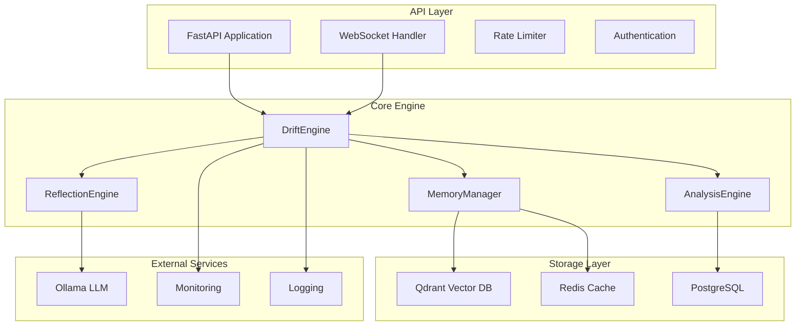
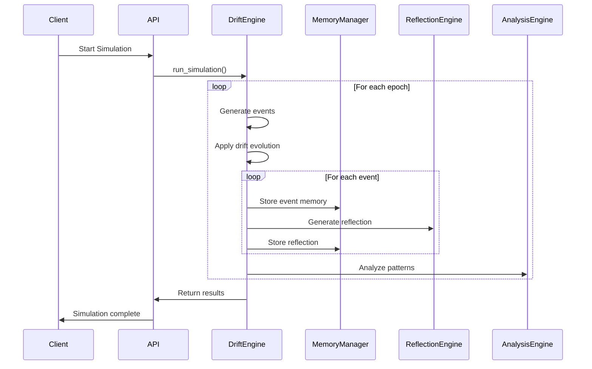

# Glitch Core Architecture

## Overview

Glitch Core is a temporal AI interpretability engine designed to track personality evolution and drift patterns in AI systems. The architecture follows a modular, dependency-injected design with clear separation of concerns.

## System Architecture



## Core Components

### 1. DriftEngine

The central orchestrator that manages personality evolution simulations.

**Responsibilities:**
- Run multi-epoch personality simulations
- Apply drift profiles and evolution rules
- Track emotional state changes
- Detect pattern emergence
- Manage interventions

**Key Methods:**
- `run_simulation()`: Execute complete simulation
- `inject_intervention()`: Apply external interventions
- `_generate_epoch_events()`: Create events for each epoch
- `_apply_drift_evolution()`: Apply personality evolution rules

### 2. MemoryManager

Handles temporal memory with personality-specific encoding.

**Responsibilities:**
- Store and retrieve memories with emotional context
- Implement temporal decay for memories
- Provide semantic similarity search
- Manage active context window

**Key Methods:**
- `save_memory()`: Store new memory with metadata
- `retrieve_contextual()`: Get relevant memories for context
- `_calculate_decay_rate()`: Apply temporal decay
- `_rank_by_relevance()`: Score memories by relevance

### 3. ReflectionEngine

Generates persona-specific reflections using LLM integration.

**Responsibilities:**
- Generate contextual reflections
- Handle LLM service communication
- Manage token usage and costs
- Provide fallback responses

**Key Methods:**
- `generate_reflection()`: Create reflection from context
- `_call_ollama()`: Communicate with LLM service
- `_construct_prompt()`: Build LLM prompts
- `_analyze_emotional_impact()`: Assess reflection impact

### 4. AnalysisEngine

Provides statistical analysis and visualization capabilities.

**Responsibilities:**
- Analyze drift patterns and trends
- Generate stability metrics
- Create visualizations
- Export analysis results

## Data Flow



## Configuration Management

The system uses dependency injection for configuration management:

```python
class Container(containers.DeclarativeContainer):
    config = providers.Singleton(Settings)
    memory_manager = providers.Singleton(MemoryManager, settings=config)
    reflection_engine = providers.Singleton(ReflectionEngine, settings=config)
    drift_engine = providers.Singleton(DriftEngine, settings=config, 
                                     memory_manager=memory_manager,
                                     reflection_engine=reflection_engine)
```

## Error Handling

The system implements comprehensive error handling with:

1. **Custom Exception Hierarchy**: Specific exceptions for different error types
2. **Circuit Breaker Pattern**: Prevents cascading failures
3. **Retry Logic**: Handles transient failures
4. **Graceful Degradation**: Continues operation with reduced functionality

## Security

- **Authentication**: JWT-based authentication
- **Authorization**: Role-based access control
- **Rate Limiting**: Prevents abuse
- **Input Validation**: Sanitizes all inputs
- **Security Headers**: Protects against common attacks

## Monitoring and Observability

- **Metrics**: Prometheus metrics collection
- **Tracing**: OpenTelemetry distributed tracing
- **Logging**: Structured logging with correlation IDs
- **Health Checks**: Comprehensive health monitoring

## Performance Considerations

- **Caching**: Redis for frequently accessed data
- **Connection Pooling**: Efficient database connections
- **Async Operations**: Non-blocking I/O operations
- **Streaming**: Real-time simulation updates
- **Compression**: Memory and data compression

## Scalability

- **Horizontal Scaling**: Stateless API design
- **Database Sharding**: Distributed data storage
- **Load Balancing**: Multiple service instances
- **Caching Strategy**: Multi-level caching

## Research Methodology

The system implements psychological research principles:

1. **Personality Theory**: Based on Big Five personality traits
2. **Memory Models**: Temporal decay and emotional encoding
3. **Drift Patterns**: Tracking personality evolution over time
4. **Intervention Studies**: Measuring intervention effectiveness

## Development Guidelines

### Code Organization
- **src/glitch_core/**: Main application code
- **tests/**: Comprehensive test suite
- **docs/**: Documentation and guides
- **scripts/**: Utility scripts and tools

### Testing Strategy
- **Unit Tests**: Individual component testing
- **Integration Tests**: Component interaction testing
- **End-to-End Tests**: Full system testing
- **Performance Tests**: Load and stress testing

### Deployment
- **Docker**: Containerized deployment
- **Docker Compose**: Local development environment
- **Kubernetes**: Production orchestration
- **CI/CD**: Automated deployment pipeline

## Future Enhancements

1. **Distributed Simulations**: Multi-node simulation support
2. **Advanced Visualizations**: 3D personality evolution plots
3. **Research Integration**: Academic paper integration
4. **Collaboration Features**: Multi-user research environments
5. **Real-time Analysis**: Live pattern detection 