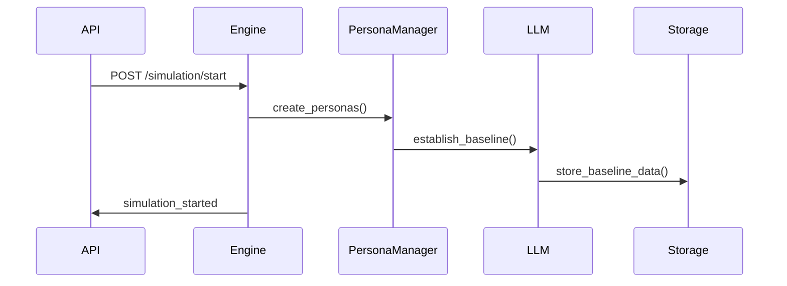
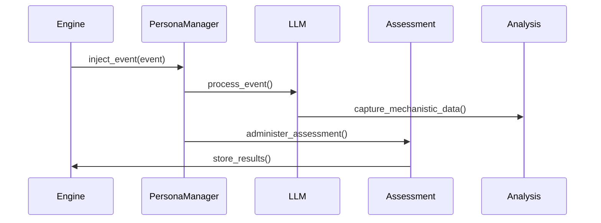
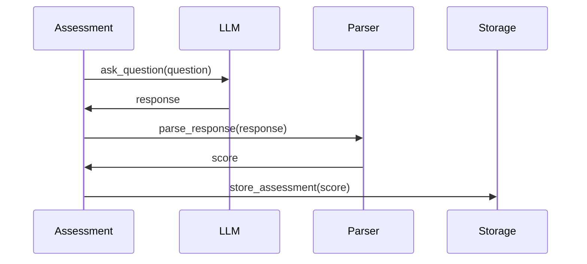

# Architecture Overview

This document provides a comprehensive overview of the AI Personality Drift Simulation system architecture.

## System Overview

The system is designed as a microservices architecture with the following key components:

```
┌─────────────────┐    ┌─────────────────┐    ┌─────────────────┐
│   Frontend      │    │   FastAPI       │    │   Simulation    │
│   Dashboard     │◄──►│   Application   │◄──►│   Engine        │
└─────────────────┘    └─────────────────┘    └─────────────────┘
                                │
                                ▼
┌─────────────────┐    ┌─────────────────┐    ┌─────────────────┐
│   Redis         │    │   Qdrant        │    │   Ollama        │
│   (Sessions)    │    │   (Memory)      │    │   (LLM)         │
└─────────────────┘    └─────────────────┘    └─────────────────┘
```

## Core Components

### 1. API Layer (`src/api/`)

**FastAPI Application** - Main entry point for all external interactions

```python
# Key components:
- app.py              # Application factory and configuration
- routes/             # API endpoint definitions
  ├── simulation.py   # Simulation control endpoints
  ├── data.py         # Data access endpoints
  ├── monitoring.py   # Health and status endpoints
  └── websocket.py    # Real-time communication
```

**Key Features:**
- RESTful API with OpenAPI documentation
- WebSocket support for real-time updates
- CORS configuration for frontend integration
- Background task management
- Static file serving for frontend

### 2. Simulation Engine (`src/services/simulation_engine.py`)

**Core orchestration service** that manages the entire simulation lifecycle

```python
class SimulationEngine:
    - initialize_simulation()    # Setup personas and conditions
    - run_simulation()          # Main simulation loop
    - pause_simulation()        # Pause execution
    - resume_simulation()       # Resume execution
    - stop_simulation()         # Clean shutdown
```

**Key Responsibilities:**
- Persona lifecycle management
- Event scheduling and injection
- Assessment administration
- Time compression (5 years → 4-6 hours)
- Progress tracking and checkpointing

### 3. Persona Management (`src/services/persona_manager.py`)

**Persona lifecycle and state management**

```python
class PersonaManager:
    - create_persona()          # Initialize new persona
    - update_persona_state()    # Update personality state
    - administer_assessment()   # Run psychiatric assessments
    - process_event()           # Handle simulation events
    - get_persona_memory()      # Retrieve memory data
```

**Key Features:**
- Personality baseline establishment
- State persistence and recovery
- Memory integration with LLM responses
- Cross-assessment consistency

### 4. Assessment System (`src/assessment/`)

**Psychiatric assessment administration and scoring**

```python
# Assessment scales:
- phq9.py           # Depression assessment (PHQ-9)
- gad7.py            # Anxiety assessment (GAD-7)
- pss10.py           # Stress assessment (PSS-10)
- assessment_service.py  # Orchestration service
```

**Key Features:**
- Natural language question administration
- Response parsing and validation
- Clinical scoring and interpretation
- Longitudinal trend analysis

### 5. Mechanistic Analysis (`src/interpretability/`)

**Neural circuit analysis during LLM inference**

```python
# Key components:
- attention_capture.py    # Attention weight extraction
- activation_patching.py  # Layer-wise interventions
- circuit_tracking.py     # Neural circuit monitoring
- drift_detection.py      # Change point detection
```

**Key Features:**
- Real-time attention pattern capture
- Activation patching for causal analysis
- Self-reference circuit tracking
- Drift detection algorithms

## Data Flow

### 1. Simulation Initialization



### 2. Event Processing



### 3. Assessment Administration



## Storage Architecture

### 1. Redis (`src/storage/redis_client.py`)

**Session and cache storage**

```python
# Key data types:
- Simulation state          # Current simulation status
- Persona sessions         # Active persona data
- Assessment cache         # Cached assessment results
- Event queue             # Pending events
```

### 2. Qdrant (`src/storage/qdrant_client.py`)

**Vector database for memory storage**

```python
# Collections:
- persona_memories         # Long-term memory embeddings
- assessment_history       # Historical assessment data
- mechanistic_data        # Neural analysis results
- event_embeddings        # Event memory representations
```

### 3. File Storage (`src/storage/file_storage.py`)

**Data export and archival**

```python
# Export formats:
- CSV                     # Tabular data
- JSON                    # Structured data
- Parquet                 # Efficient binary format
- YAML                    # Configuration snapshots
```

## Configuration Management

### 1. Environment Configuration (`src/core/config.py`)

**Application-wide settings**

```python
class Settings:
    # Application settings
    APP_NAME: str
    VERSION: str
    API_PREFIX: str
    
    # Database connections
    REDIS_URL: str
    QDRANT_URL: str
    
    # LLM configuration
    OLLAMA_BASE_URL: str
    MODEL_NAME: str
    
    # Simulation parameters
    SIMULATION_TIMEOUT: int
    MAX_CONCURRENT_PERSONAS: int
```

### 2. Experiment Configuration (`config/experiments/`)

**Study-specific parameters**

```yaml
# clinical_thresholds.yaml
phq9:
  mild: 5
  moderate: 10
  severe: 15

# personality_drift.yaml
stress_scaling:
  low: 0.1
  medium: 0.3
  high: 0.5

# simulation_timing.yaml
compression_factor: 4380  # 5 years → 4 hours
assessment_interval: 7    # Weekly assessments
```

## Security Considerations

### 1. API Security

- **CORS Configuration**: Restricted origins
- **Input Validation**: Pydantic model validation
- **Error Handling**: Secure error responses

### 2. Data Security

- **Environment Variables**: Sensitive configuration

## Performance Optimization

### 1. LLM Optimization

- **Model Quantization**: Reduced memory footprint
- **Response Caching**: Avoid redundant computations
- **Batch Processing**: Efficient multi-persona handling
- **Memory Management**: Garbage collection optimization


### 2. Simulation Optimization

- **Time Compression**: Accelerated simulation loops
- **Parallel Processing**: Concurrent persona management
- **Checkpointing**: Efficient state persistence
- **Resource Monitoring**: Memory and CPU optimization (we optimize for M1max, 32Gb RAM)

## Monitoring and Observability

### 1. Logging (`src/core/logging.py`)

**Structured logging throughout the application**

```python
# Log levels:
- DEBUG     # Detailed debugging information
- INFO      # General application flow
- WARNING   # Potential issues
- ERROR     # Error conditions
- CRITICAL  # Critical failures
```


### 2. Health Checks

```python
# Health endpoints:
- /api/v1/health          # Basic health check
- /api/v1/status          # Detailed system status
```

## Deployment Architecture

### 1. Local Development Environment

```yaml
# docker-compose.yml
services:
  app:          # FastAPI application
  redis:        # Session storage
  qdrant:       # Vector database
  ollama:       # LLM service
  frontend:     # Web dashboard (optional)
```

## Future Architecture Considerations

### 1. Production Considerations
- **Production optimization**: multistage docker, with external cloud services
- **Cloud Database w Clustering**: High availability setup
- **Monitoring Stack**: Prometheus + Grafana
- **Log Aggregation**: Centralized logging
